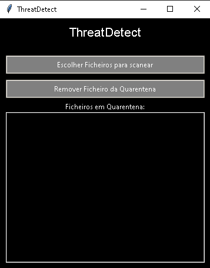

# AntiVirus 
## Version 1.0.0

Repository for advanced antivirus development in Python.

## Summary

This repository contains the development of an advanced antivirus system using Python.  
The project aims to detect threats through hash verification and heuristic analysis.  
It has a graphical interface (GUI) using Tkinter, allowing users to scan and manage threats easily.

### Important Dates

* Antivirus release - 31/10/2024

### Commits

- **1 - First version of the antivirus**: Antivirus initial structure.

### Tools Used

- **Python**: Programming language used for development.
- **Tkinter**: GUI framework for building the graphical interface.
- **Hashlib**: Library for hash verification to detect changes in files.
- **OS & Shutil**: Libraries for file management and manipulation.
- **Pillow**: Library for image processing used in the GUI.

### Installation & Execution

1. Clone the repository:
    ```bash
    git clone https://github.com/Tiago-2007/Antivirus
    cd Antivirus
    ```

2. Install dependencies:
    ```bash
    pip install pillow
    ```

3. Run the application:
    ```bash
    python .\Antivirus.py
    ```

### AntiVirus Image


